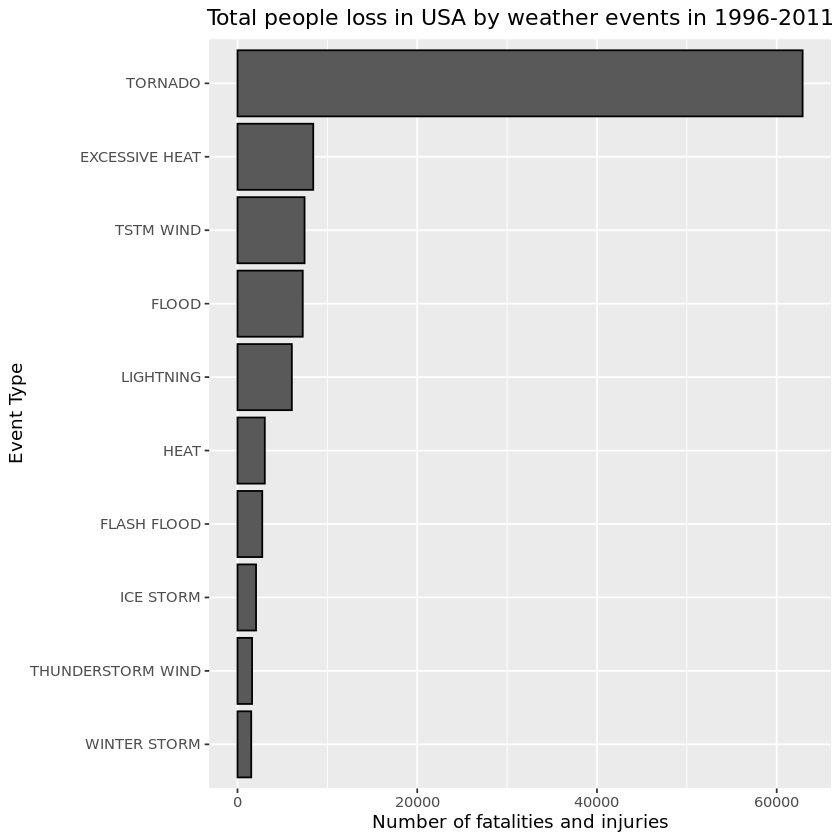
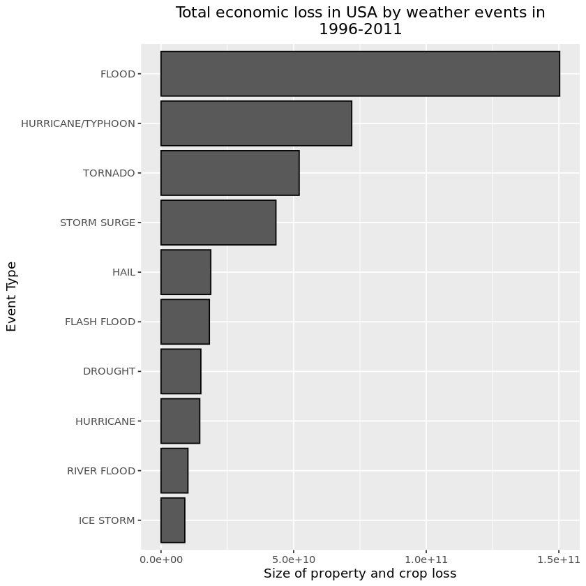

Analysis the U.S. National Oceanic and Atmospheric Administration's (NOAA) storm database

This project explores the NOAA storm database, which tracks major
storms and weather events, to address the most severe types of
weather events in the USA, which caused greatest damage to human
population in terms of fatalities/injuries and economic loss during the
years 1950 - 2011. 

There are two goals of this analysis:

• identify the weather events that are most harmful with respect to population health

• identify the weather events that have the greatest economic consequences.

Based on our analysis, we conclude that TORNADOS and FLOODS
are most harmful weather events in the USA in terms of the risk to
human health and economic impact. 

Data processing


```R
Url_data <- "https://d396qusza40orc.cloudfront.net/repdata%2Fdata%2FStormData.csv.bz2"
```


```R
File_data <- "StormData.csv.bz2"
if (!file.exists(File_data)) {
 download.file(Url_data, File_data, mode = "wb") }
```


```R
data <-read.csv(file = File_data, header=TRUE, sep=",")
```


```R
head(data)
```


<table>
<caption>A data.frame: 6 × 37</caption>
<thead>
	<tr><th></th><th scope=col>STATE__</th><th scope=col>BGN_DATE</th><th scope=col>BGN_TIME</th><th scope=col>TIME_ZONE</th><th scope=col>COUNTY</th><th scope=col>COUNTYNAME</th><th scope=col>STATE</th><th scope=col>EVTYPE</th><th scope=col>BGN_RANGE</th><th scope=col>BGN_AZI</th><th scope=col>⋯</th><th scope=col>CROPDMGEXP</th><th scope=col>WFO</th><th scope=col>STATEOFFIC</th><th scope=col>ZONENAMES</th><th scope=col>LATITUDE</th><th scope=col>LONGITUDE</th><th scope=col>LATITUDE_E</th><th scope=col>LONGITUDE_</th><th scope=col>REMARKS</th><th scope=col>REFNUM</th></tr>
	<tr><th></th><th scope=col>&lt;dbl&gt;</th><th scope=col>&lt;fct&gt;</th><th scope=col>&lt;fct&gt;</th><th scope=col>&lt;fct&gt;</th><th scope=col>&lt;dbl&gt;</th><th scope=col>&lt;fct&gt;</th><th scope=col>&lt;fct&gt;</th><th scope=col>&lt;fct&gt;</th><th scope=col>&lt;dbl&gt;</th><th scope=col>&lt;fct&gt;</th><th scope=col>⋯</th><th scope=col>&lt;fct&gt;</th><th scope=col>&lt;fct&gt;</th><th scope=col>&lt;fct&gt;</th><th scope=col>&lt;fct&gt;</th><th scope=col>&lt;dbl&gt;</th><th scope=col>&lt;dbl&gt;</th><th scope=col>&lt;dbl&gt;</th><th scope=col>&lt;dbl&gt;</th><th scope=col>&lt;fct&gt;</th><th scope=col>&lt;dbl&gt;</th></tr>
</thead>
<tbody>
	<tr><th scope=row>1</th><td>1</td><td>4/18/1950 0:00:00 </td><td>0130</td><td>CST</td><td>97</td><td>MOBILE    </td><td>AL</td><td>TORNADO</td><td>0</td><td></td><td>⋯</td><td></td><td></td><td></td><td></td><td>3040</td><td>8812</td><td>3051</td><td>8806</td><td></td><td>1</td></tr>
	<tr><th scope=row>2</th><td>1</td><td>4/18/1950 0:00:00 </td><td>0145</td><td>CST</td><td> 3</td><td>BALDWIN   </td><td>AL</td><td>TORNADO</td><td>0</td><td></td><td>⋯</td><td></td><td></td><td></td><td></td><td>3042</td><td>8755</td><td>   0</td><td>   0</td><td></td><td>2</td></tr>
	<tr><th scope=row>3</th><td>1</td><td>2/20/1951 0:00:00 </td><td>1600</td><td>CST</td><td>57</td><td>FAYETTE   </td><td>AL</td><td>TORNADO</td><td>0</td><td></td><td>⋯</td><td></td><td></td><td></td><td></td><td>3340</td><td>8742</td><td>   0</td><td>   0</td><td></td><td>3</td></tr>
	<tr><th scope=row>4</th><td>1</td><td>6/8/1951 0:00:00  </td><td>0900</td><td>CST</td><td>89</td><td>MADISON   </td><td>AL</td><td>TORNADO</td><td>0</td><td></td><td>⋯</td><td></td><td></td><td></td><td></td><td>3458</td><td>8626</td><td>   0</td><td>   0</td><td></td><td>4</td></tr>
	<tr><th scope=row>5</th><td>1</td><td>11/15/1951 0:00:00</td><td>1500</td><td>CST</td><td>43</td><td>CULLMAN   </td><td>AL</td><td>TORNADO</td><td>0</td><td></td><td>⋯</td><td></td><td></td><td></td><td></td><td>3412</td><td>8642</td><td>   0</td><td>   0</td><td></td><td>5</td></tr>
	<tr><th scope=row>6</th><td>1</td><td>11/15/1951 0:00:00</td><td>2000</td><td>CST</td><td>77</td><td>LAUDERDALE</td><td>AL</td><td>TORNADO</td><td>0</td><td></td><td>⋯</td><td></td><td></td><td></td><td></td><td>3450</td><td>8748</td><td>   0</td><td>   0</td><td></td><td>6</td></tr>
</tbody>
</table>


```R
# subsetting by data
main_data<-data
```


```R
main_data$BGN_DATE <- strptime(data$BGN_DATE, "%m/%d/%Y %H:%M:%S")
```


```R
main_data <- subset(data,main_data$BGN_DATE>1996-01-01, )

```


```R
str(main_data)
```

    'data.frame':	866041 obs. of  37 variables:
     $ STATE__   : num  1 1 1 1 1 1 1 1 1 1 ...
     $ BGN_DATE  : Factor w/ 16335 levels "1/1/1966 0:00:00",..: 3852 3852 5704 4834 4834 5092 5185 5185 5185 5185 ...
     $ BGN_TIME  : Factor w/ 3608 levels "00:00:00 AM",..: 2623 2865 2584 2732 2735 3090 1143 1555 1683 3555 ...
     $ TIME_ZONE : Factor w/ 22 levels "ADT","AKS","AST",..: 7 7 7 7 7 7 7 7 7 7 ...
     $ COUNTY    : num  97 63 129 67 5 57 65 73 125 17 ...
     $ COUNTYNAME: Factor w/ 29601 levels "","5NM E OF MACKINAC BRIDGE TO PRESQUE ISLE LT MI",..: 13513 5653 27256 5778 1887 4598 5714 8485 24418 2808 ...
     $ STATE     : Factor w/ 72 levels "AK","AL","AM",..: 2 2 2 2 2 2 2 2 2 2 ...
     $ EVTYPE    : Factor w/ 985 levels "   HIGH SURF ADVISORY",..: 856 856 834 856 856 244 834 244 856 834 ...
     $ BGN_RANGE : num  0 0 0 0 0 0 0 0 0 0 ...
     $ BGN_AZI   : Factor w/ 35 levels "","  N"," NW",..: 1 1 1 1 1 1 1 1 1 1 ...
     $ BGN_LOCATI: Factor w/ 54429 levels ""," Christiansburg",..: 1 1 1 1 1 1 1 1 1 1 ...
     $ END_DATE  : Factor w/ 6663 levels "","1/1/1993 0:00:00",..: 1 1 1 1 1 1 1 1 1 1 ...
     $ END_TIME  : Factor w/ 3647 levels ""," 0900CST",..: 1 1 1 1 1 1 1 1 1 1 ...
     $ COUNTY_END: num  0 0 0 0 0 0 0 0 0 0 ...
     $ COUNTYENDN: logi  NA NA NA NA NA NA ...
     $ END_RANGE : num  0 0 0 0 0 0 0 0 0 0 ...
     $ END_AZI   : Factor w/ 24 levels "","E","ENE","ESE",..: 1 1 1 1 1 1 1 1 1 1 ...
     $ END_LOCATI: Factor w/ 34506 levels ""," CANTON"," TULIA",..: 1 1 1 1 1 1 1 1 1 1 ...
     $ LENGTH    : num  0 0 0 0 0 0 1 0 0 2 ...
     $ WIDTH     : num  0 0 33 0 0 0 33 0 0 200 ...
     $ F         : int  NA NA 2 NA NA NA 2 NA NA 3 ...
     $ MAG       : num  51 0 0 0 0 75 0 100 0 0 ...
     $ FATALITIES: num  0 0 0 0 0 0 0 0 0 2 ...
     $ INJURIES  : num  0 0 0 0 0 0 0 0 0 14 ...
     $ PROPDMG   : num  0 0 25 0 0 0 25 0 0 250 ...
     $ PROPDMGEXP: Factor w/ 19 levels "","-","?","+",..: 1 1 17 1 1 1 17 1 1 17 ...
     $ CROPDMG   : num  0 0 0 0 0 0 0 0 0 0 ...
     $ CROPDMGEXP: Factor w/ 9 levels "","?","0","2",..: 1 1 1 1 1 1 1 1 1 1 ...
     $ WFO       : Factor w/ 542 levels ""," CI","%SD",..: 1 1 1 1 1 1 1 1 1 1 ...
     $ STATEOFFIC: Factor w/ 250 levels "","ALABAMA, Central",..: 1 1 1 1 1 1 1 1 1 1 ...
     $ ZONENAMES : Factor w/ 25112 levels "","                                                                                                               "| __truncated__,..: 1 1 1 1 1 1 1 1 1 1 ...
     $ LATITUDE  : num  3042 3247 3128 3136 3142 ...
     $ LONGITUDE : num  8817 8754 8815 8517 8524 ...
     $ LATITUDE_E: num  0 0 0 0 0 0 0 0 0 0 ...
     $ LONGITUDE_: num  0 0 0 0 0 0 0 0 0 0 ...
     $ REMARKS   : Factor w/ 436781 levels "","\t","\t\t",..: 1 1 1 1 1 1 1 1 1 1 ...
     $ REFNUM    : num  799 800 801 802 803 804 805 806 807 808 ...


```R
main_data <- subset(main_data, select = c(EVTYPE, FATALITIES, INJURIES, PROPDMG,
PROPDMGEXP, CROPDMG, CROPDMGEXP))
```


```R
#cleaning event types names
main_data$EVTYPE <- toupper(main_data$EVTYPE)
```


```R
# eliminating zero data
#main_data <- main_data[main_data$FATALITIES!=0 |main_data$INJURIES !=0 | main_data$PROPDMG !=0 | main_data$CROPDMG !=0, ]
```

Population health data processing 


```R
health_data <- aggregate(cbind(FATALITIES, INJURIES) ~ EVTYPE, data = main_data, FUN=sum)

```


```R
health_data$PEOPLE_LOSS <-health_data$FATALITIES + health_data$INJURIES
```


```R
health_data <- health_data[order(health_data$PEOPLE_LOSS, decreasing =
TRUE), ]

```


```R
Top10_events_people <- health_data[1:10,]
```


```R
Top10_events_people
```


<table>
<caption>A data.frame: 10 × 4</caption>
<thead>
	<tr><th></th><th scope=col>EVTYPE</th><th scope=col>FATALITIES</th><th scope=col>INJURIES</th><th scope=col>PEOPLE_LOSS</th></tr>
	<tr><th></th><th scope=col>&lt;chr&gt;</th><th scope=col>&lt;dbl&gt;</th><th scope=col>&lt;dbl&gt;</th><th scope=col>&lt;dbl&gt;</th></tr>
</thead>
<tbody>
	<tr><th scope=row>758</th><td>TORNADO          </td><td>3272</td><td>59611</td><td>62883</td></tr>
	<tr><th scope=row>116</th><td>EXCESSIVE HEAT   </td><td>1903</td><td> 6525</td><td> 8428</td></tr>
	<tr><th scope=row>779</th><td>TSTM WIND        </td><td> 504</td><td> 6957</td><td> 7461</td></tr>
	<tr><th scope=row>154</th><td>FLOOD            </td><td> 470</td><td> 6789</td><td> 7259</td></tr>
	<tr><th scope=row>418</th><td>LIGHTNING        </td><td> 816</td><td> 5230</td><td> 6046</td></tr>
	<tr><th scope=row>243</th><td>HEAT             </td><td> 937</td><td> 2100</td><td> 3037</td></tr>
	<tr><th scope=row>138</th><td>FLASH FLOOD      </td><td> 978</td><td> 1777</td><td> 2755</td></tr>
	<tr><th scope=row>387</th><td>ICE STORM        </td><td>  89</td><td> 1975</td><td> 2064</td></tr>
	<tr><th scope=row>685</th><td>THUNDERSTORM WIND</td><td> 133</td><td> 1488</td><td> 1621</td></tr>
	<tr><th scope=row>888</th><td>WINTER STORM     </td><td> 206</td><td> 1321</td><td> 1527</td></tr>
</tbody>
</table>


Economic consequences data processing 


```R
main_data$PROPDMGEXP <- gsub("[Hh]", "2", main_data$PROPDMGEXP)
main_data$PROPDMGEXP <- gsub("[Kk]", "3", main_data$PROPDMGEXP)
main_data$PROPDMGEXP <- gsub("[Mm]", "6", main_data$PROPDMGEXP)
main_data$PROPDMGEXP <- gsub("[Bb]", "9", main_data$PROPDMGEXP)
main_data$PROPDMGEXP <- gsub("\\+", "1", main_data$PROPDMGEXP)
main_data$PROPDMGEXP <- gsub("\\?|\\-|\\ ", "0", main_data$PROPDMGEXP)
main_data$PROPDMGEXP <- as.numeric(main_data$PROPDMGEXP)
```


```R
main_data$CROPDMGEXP <- gsub("[Hh]", "2", main_data$CROPDMGEXP)
main_data$CROPDMGEXP <- gsub("[Kk]", "3", main_data$CROPDMGEXP)
main_data$CROPDMGEXP <- gsub("[Mm]", "6", main_data$CROPDMGEXP)
main_data$CROPDMGEXP <- gsub("[Bb]", "9", main_data$CROPDMGEXP)
main_data$CROPDMGEXP <- gsub("\\+", "1", main_data$CROPDMGEXP)
main_data$CROPDMGEXP <- gsub("\\-|\\?|\\ ", "0", main_data$CROPDMGEXP)
main_data$CROPDMGEXP <- as.numeric(main_data$CROPDMGEXP)
main_data$PROPDMGEXP[is.na(main_data$PROPDMGEXP)] <- 0
main_data$CROPDMGEXP[is.na(main_data$CROPDMGEXP)] <- 0
```


```R
#creating total damage values
library(dplyr)

```


```R
main_data <- mutate(main_data, PROPDMGTOTAL = PROPDMG * (10 ^ PROPDMGEXP), CROPDMGTOTAL = CROPDMG * (10 ^ CROPDMGEXP))
```


```R
Economic <- aggregate(cbind(PROPDMGTOTAL, CROPDMGTOTAL) ~ EVTYPE, data = main_data, FUN=sum)
```


```R
Economic $ECONOMIC_LOSS <- Economic$PROPDMGTOTAL + Economic $CROPDMGTOTAL
Economic <- Economic[order(Economic$ECONOMIC_LOSS, decreasing =TRUE), ]
```


```R
Top10_events_economy <- Economic[1:10,]
```


```R
Top10_events_economy
```


<table>
<caption>A data.frame: 10 × 4</caption>
<thead>
	<tr><th></th><th scope=col>EVTYPE</th><th scope=col>PROPDMGTOTAL</th><th scope=col>CROPDMGTOTAL</th><th scope=col>ECONOMIC_LOSS</th></tr>
	<tr><th></th><th scope=col>&lt;chr&gt;</th><th scope=col>&lt;dbl&gt;</th><th scope=col>&lt;dbl&gt;</th><th scope=col>&lt;dbl&gt;</th></tr>
</thead>
<tbody>
	<tr><th scope=row>154</th><td>FLOOD            </td><td>144657709807</td><td> 5661968450</td><td>150319678257</td></tr>
	<tr><th scope=row>372</th><td>HURRICANE/TYPHOON</td><td> 69305840000</td><td> 2607872800</td><td> 71913712800</td></tr>
	<tr><th scope=row>758</th><td>TORNADO          </td><td> 51673434936</td><td>  414953270</td><td> 52088388206</td></tr>
	<tr><th scope=row>599</th><td>STORM SURGE      </td><td> 43323536000</td><td>       5000</td><td> 43323541000</td></tr>
	<tr><th scope=row>212</th><td>HAIL             </td><td> 15735267513</td><td> 3025954473</td><td> 18761221986</td></tr>
	<tr><th scope=row>138</th><td>FLASH FLOOD      </td><td> 16822673978</td><td> 1421317100</td><td> 18243991078</td></tr>
	<tr><th scope=row>84</th><td>DROUGHT          </td><td>  1046106000</td><td>13972566000</td><td> 15018672000</td></tr>
	<tr><th scope=row>363</th><td>HURRICANE        </td><td> 11868319010</td><td> 2741910000</td><td> 14610229010</td></tr>
	<tr><th scope=row>529</th><td>RIVER FLOOD      </td><td>  5118945500</td><td> 5029459000</td><td> 10148404500</td></tr>
	<tr><th scope=row>387</th><td>ICE STORM        </td><td>  3944927860</td><td> 5022113500</td><td>  8967041360</td></tr>
</tbody>
</table>


Results


```R
#plotting health loss
library(ggplot2)
g <- ggplot(data = Top10_events_people, aes(x = reorder(EVTYPE, PEOPLE_LOSS), y= PEOPLE_LOSS))
g <- g + geom_bar(stat = "identity", colour = "black") + labs(title = "Total people loss in USA by weather events in 1996-2011") + theme(plot.title = element_text(hjust = 0.5))  + labs(y = "Number of fatalities and injuries", x = "Event Type") + coord_flip()
```


```R
print(g)
```





```R
#plotting economic loss
g <- ggplot(data = Top10_events_economy, aes(x = reorder(EVTYPE, ECONOMIC_LOSS), y = ECONOMIC_LOSS))
g <- g + geom_bar(stat = "identity", colour = "black") + labs(title = "Total economic loss in USA by weather events in
1996-2011") + theme(plot.title = element_text(hjust = 0.5)) + labs(y = "Size of property and crop loss", x = "Event Type") + coord_flip()

```


```R
print(g)
```





```R

```
